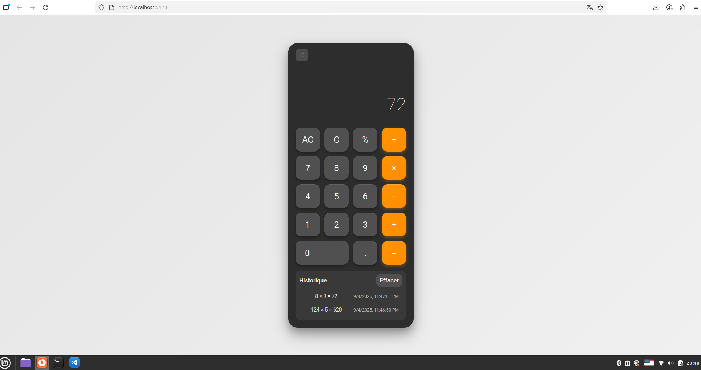

# 🧮 Calculatrice Vue.js

Une calculatrice moderne et élégante développée avec Vue.js, offrant une interface utilisateur fluide inspirée du design iOS avec un historique des calculs persistant.

## 📋 Fonctionnalités

- ✨ Interface utilisateur moderne avec animations fluides
- 🧮 Opérations arithmétiques de base (+, -, ×, ÷)
- 📊 Gestion des pourcentages
- 🔄 Changement de signe (+/-)
- 📝 Historique des calculs avec sauvegarde locale
- ⌨️ Support du clavier
- 📱 Design responsive inspiré d'iOS

## 🏗️ Architecture

### Composants Principaux

**Calculator.vue** - Composant racine avec la logique de calcul, gestion de l'historique et support clavier

**Display.vue** - Affichage des calculs en cours et résultats

**ButtonGrid.vue** - Grille organisée des boutons de la calculatrice  

**CalcButton.vue** - Bouton réutilisable avec styles et animations

**HistoryPanel.vue** - Gestion et affichage de l'historique des calculs

## ⌨️ Raccourcis Clavier

- `0-9` : Chiffres
- `+ - * /` : Opérateurs  
- `Enter` ou `=` : Calcul
- `Backspace` : Effacer
- `Escape` : Tout effacer

## 🚀 Installation

```bash
# Installer les dépendances
npm install

# Lancer en développement
npm run dev
```

## 🔧 Technologies

Vue.js 3 • CSS3 Grid • LocalStorage • ES6+


## 🎥 Aperçu


